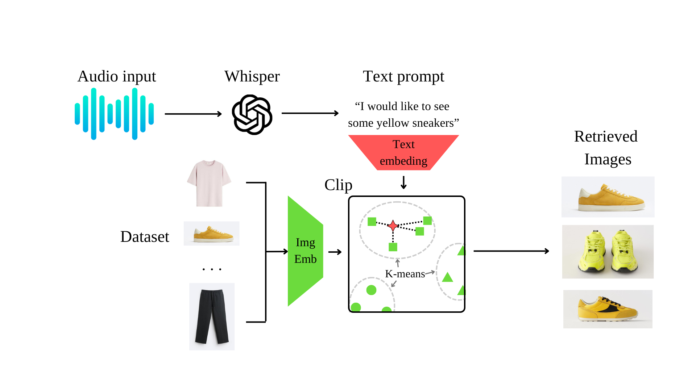

# <div align="center">Inditech: Multimodal AI Shopping App for ZARA


## Overview

Inditech is designed to revolutionize the online shopping experience at ZARA by integrating advanced multimodal AI capabilities. This application allows users to interactively search and navigate through ZARA's product catalog using voice commands and hand gestures. Our goal is to simplify and enhance the shopping process, making it more interactive and user-friendly.

### Inspiration

Our goal was to integrate multimodal AI capabilities to enhance the e-commerce experience for ZARA. We recognized the potential of voice and gesture-based navigation to simplify and enrich online shopping, making it more interactive and user-friendly.

### Network Architecture



### Features

- **Voice Search**: Users can speak to the app to find products, using natural language processing to analyze and respond to user queries.
- **Gesture Navigation**: The app includes a hand gesture detection algorithm that allows users to give thumbs up or thumbs down to navigate through product options.
- **Multiple Product Views**: Clicking on products displays them from various angles, enhancing the virtual shopping experience.

## Technology Stack

- **Backend**: Python, Flask
- **Frontend**: HTML, CSS, JavaScript
- **AI & Machine Learning**: OpenCV, Hugging Face Transformers, Fashion-CLIP, OpenAI Whisper

## Installation

To get started with Inditech, clone the repository and follow these installation steps:

```bash
git clone https://github.com/Neilus03/hackupc-2024.git
cd hackupc-2024
# Install dependencies
pip install -r requirements.txt
# Run the application
python app.py
```

## Usage

After launching the app, navigate to `localhost:5000` in your web browser to start using Inditech. Use your microphone for voice commands and your webcam for gesture recognition.

## How It Works: In Depth Explanation

### Voice Command Processing
Inditech uses OpenAI Whisper to process voice commands. When a user speaks into the app, Whisper converts the spoken language into text. This text is passed through the Fashion-CLIP model to get the embedding and find the most matching images. This allows the app to handle a wide range of voice inputs, and real natural language, like divagation and doubt, and convert them into actionable queries tailored to ZARA's product catalog.

### Gesture Recognition
For gesture-based navigation, Inditech utilizes OpenCV to capture and analyze real-time video from the user's webcam. The system is trained to recognize specific hand gestures—such as thumbs up and thumbs down—using a YOLO model. This model has been trained on a diverse dataset to ensure it performs well across different lighting conditions and skin tones. Gesture inputs are used to navigate through product options without the need for traditional clicking, making the shopping experience smoother and more interactive.

### Product Display and Interaction
Once a product is selected via voice or gesture, the app retrieves detailed information and images from a backend database managed by Flask. The frontend, developed with HTML, CSS, and JavaScript, displays these products dynamically. Users can interact with the product images to view them from different angles, enhancing the visual aspect of online shopping.

### Utilizing Fashion-CLIP for Product Matching
Fashion-CLIP is crucial for enhancing the accuracy of product recommendations. Once the intent and keywords are extracted from user commands, Fashion-CLIP generates visual and textual embeddings that capture the stylistic and contextual nuances of fashion items. These embeddings are then used to match the user's verbal requests with the most relevant products in ZARA's catalog. By comparing embeddings, Inditech can identify items that visually and contextually align with user preferences, significantly improving the relevance of search results.

### Backend Integration
The backend, powered by Python and Flask, serves as the bridge between the AI models and the frontend interface. It handles all server-side logic, including API calls to ZARA's database for product information, processing user commands, and managing user sessions. This architecture ensures that Inditech is scalable, maintainable, and responsive.

### Challenges and Solutions
Integrating multimodal inputs presented unique challenges, particularly in synchronizing voice and gesture inputs smoothly. To address this, we implemented asynchronous processing techniques that allow the system to handle multiple input modes efficiently without lagging. Additionally, continuous integration and testing were crucial in ensuring that updates did not break functionality, especially when dealing with external APIs and databases.

## Authors

- **Neil de la Fuente** - [Github](https://github.com/Neilus03) - [LinkedIn](https://www.linkedin.com/in/neil-de-la-fuente/)
- **Maria Pilligua** - [Github](https://github.com/mpilligua) - [LinkedIn](https://www.linkedin.com/in/mariapilligua/)
- **Daniel Vidal** - [Github](https://github.com/Dani13vg) - [LinkedIn](https://www.linkedin.com/in/daniel-alejandro-vidal-guerra-21386b266/)
- **Alex Roldan** - [Github](https://github.com/alrocb) - [LinkedIn](https://www.linkedin.com/in/alex-roldan-55488a215/)

## Acknowledgments

- Thanks to HackUPC 2024 for the opportunity to develop this innovative solution.
- Thanks to Inditex for proposing the challenge and providing the data.
- Special thanks to mentors and everyone who supported us during the hackathon.


